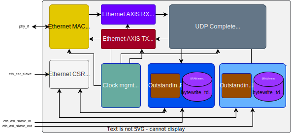

# AXI Ethernet (UDP)

## Table of Contents
* [Introduction](#intro)
* [Run tests](#test)
* [uArch](#uarch)
* [CSRs](#csrs)
* [License](#lic)

##  Introduction

##  Run tests

##  Microarchitecture

##  CSRs - Control & Status Registers
For more details on the CSRs like address and access policy, please read the generated file available at [CSR list](csr_out/eth_csr.md). 

##  License
`AXI Ethernet` is licensed under the permissive MIT license. Please refer to the [LICENSE](LICENSE) file for details.
